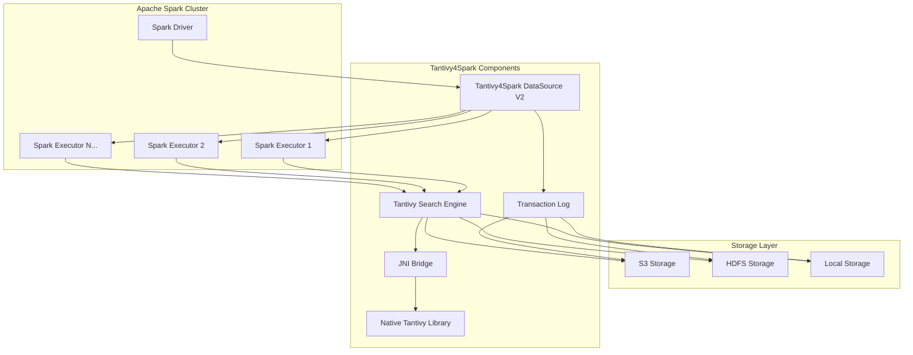
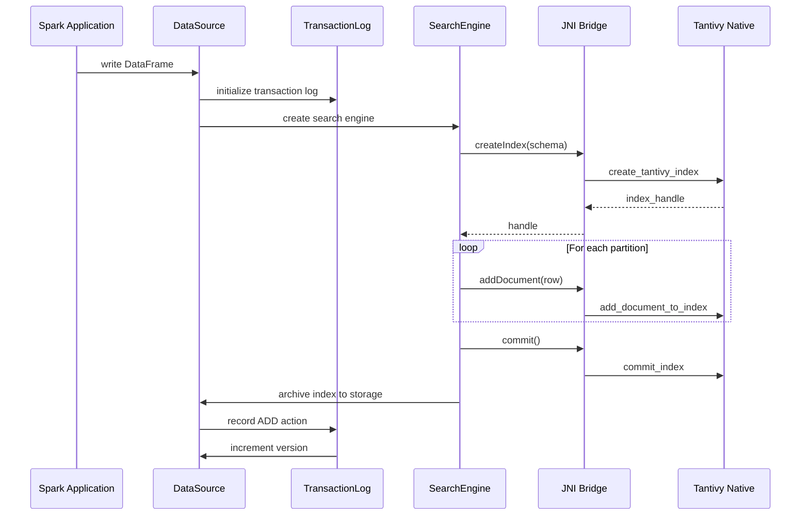
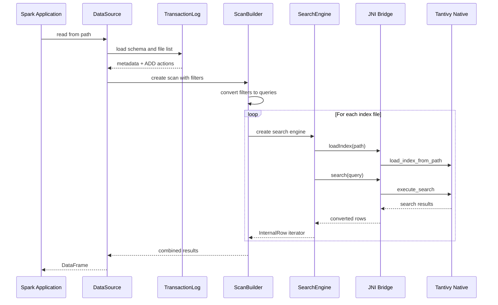
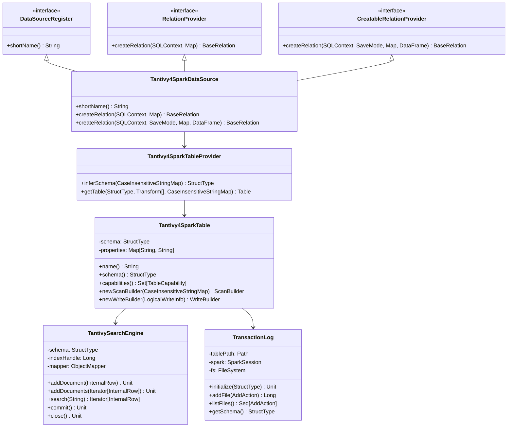
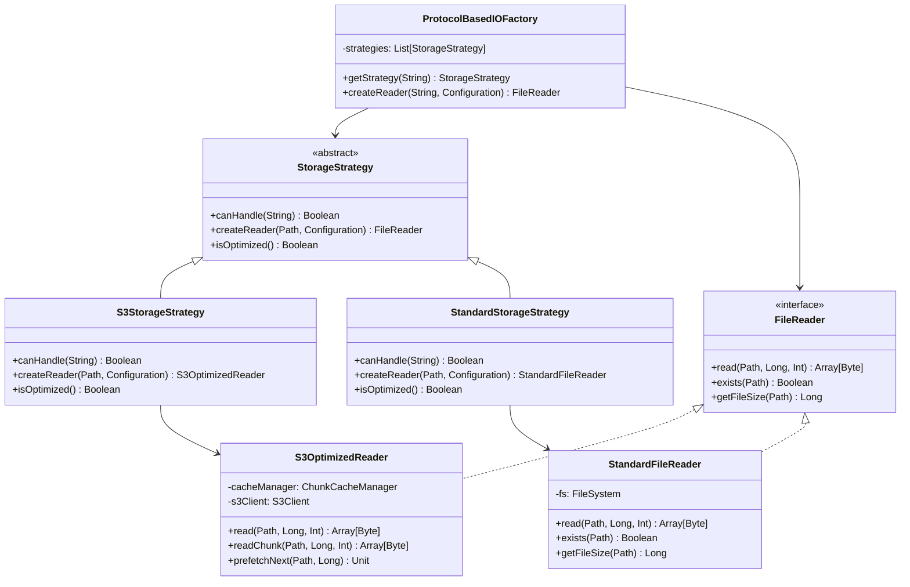
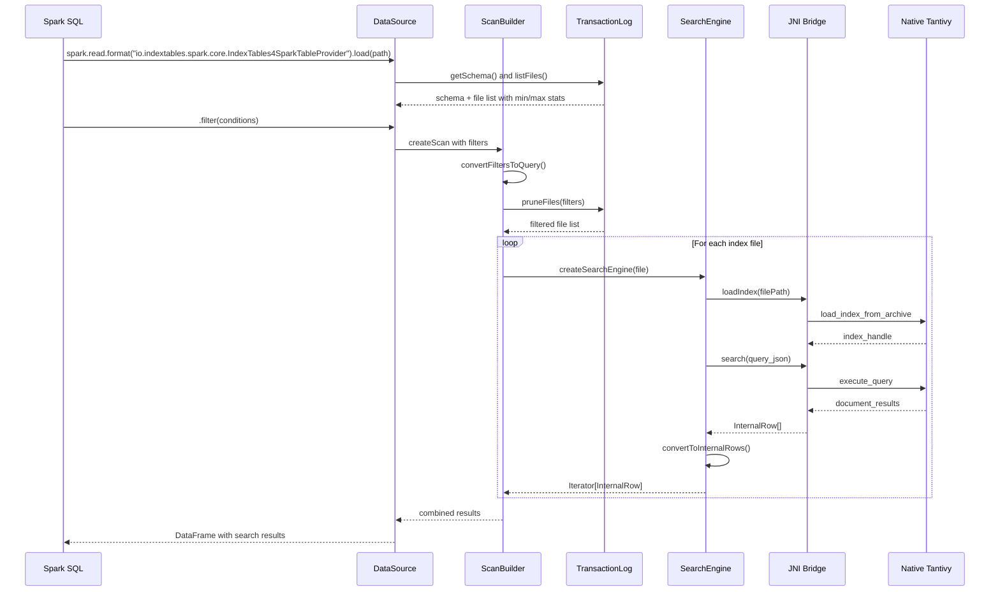
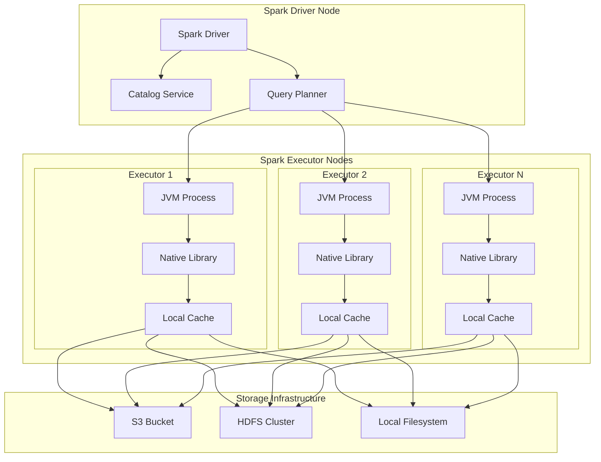

# Tantivy4Spark Architecture and Design Documentation

## Table of Contents

1. [System Overview](#system-overview)
2. [High-Level Architecture](#high-level-architecture)
3. [Component Breakdown](#component-breakdown)
4. [Data Flow and Interactions](#data-flow-and-interactions)
5. [UML Diagrams](#uml-diagrams)
6. [Design Patterns](#design-patterns)
7. [Security and Performance Considerations](#security-and-performance-considerations)
8. [Deployment Architecture](#deployment-architecture)

## System Overview

**Tantivy4Spark** is a high-performance file format and search engine integration for Apache Spark that embeds the Tantivy full-text search engine directly within Spark executors via JNI. The system provides fast full-text search capabilities without requiring external server components.

### Core Design Principles

- **Embedded Architecture**: Tantivy runs directly within Spark executors
- **Zero External Dependencies**: No separate search servers required
- **Transaction Consistency**: Delta-like transaction log for ACID properties
- **Storage Agnostic**: Supports local, HDFS, and cloud storage (S3)
- **High Performance**: Optimized I/O with predictive caching and range requests

## High-Level Architecture



## Component Breakdown

### 1. Core Layer (`com.tantivy4spark.core`)

#### Tantivy4SparkDataSource
- **Purpose**: Main entry point implementing Spark DataSource V2 API
- **Responsibilities**:
  - Dataset registration and discovery
  - Read/write operation orchestration
  - Schema management and validation
- **Key Methods**: `createRelation()`, `getTable()`, `shortName()`

#### Tantivy4SparkScanBuilder
- **Purpose**: Query planning and optimization
- **Responsibilities**:
  - Filter pushdown to native search engine
  - Partition pruning based on min/max statistics
  - Query execution plan creation
- **Integration**: Converts Spark filters to Tantivy query syntax

#### FiltersToQueryConverter
- **Purpose**: Filter translation layer
- **Responsibilities**:
  - Convert Spark SQL filters to Tantivy queries
  - Support for text search, range queries, boolean logic
  - Null handling and type conversion

### 2. Search Layer (`com.tantivy4spark.search`)

#### TantivySearchEngine
- **Purpose**: Core search functionality wrapper
- **Responsibilities**:
  - Index lifecycle management
  - Document indexing and retrieval
  - Query execution coordination
- **Native Integration**: Direct JNI calls to Rust library

#### SchemaConverter
- **Purpose**: Schema translation between Spark and Tantivy
- **Responsibilities**:
  - Type mapping (Spark ↔ Tantivy)
  - Schema evolution support
  - Validation and compatibility checks

#### TantivyNative
- **Purpose**: JNI bridge to native Tantivy library
- **Responsibilities**:
  - Native library loading and initialization
  - Method call marshalling
  - Memory management and cleanup

### 3. Storage Layer (`com.tantivy4spark.storage`)

#### StorageStrategy
- **Purpose**: Protocol detection and I/O optimization selection
- **Responsibilities**:
  - Automatic protocol detection (s3://, hdfs://, file://)
  - Strategy pattern implementation for different storage backends
  - Configuration-driven optimization switching

#### S3OptimizedReader
- **Purpose**: High-performance S3 I/O operations
- **Responsibilities**:
  - Predictive chunk prefetching
  - Concurrent range request management
  - Intelligent caching with LRU eviction
- **Optimizations**: Range requests, connection pooling, retry logic

#### StandardFileReader
- **Purpose**: Standard Hadoop filesystem operations
- **Responsibilities**:
  - Compatibility with all Hadoop-supported filesystems
  - Standard read/write operations
  - Metadata access and directory listing

### 4. Transaction Layer (`com.tantivy4spark.transaction`)

#### TransactionLog
- **Purpose**: ACID transaction management similar to Delta Lake
- **Responsibilities**:
  - Metadata versioning and schema evolution
  - File lifecycle tracking (ADD/REMOVE operations)
  - Min/max statistics for query pruning
- **Structure**: `_transaction_log/` directory with versioned JSON files

#### Actions
- **Purpose**: Define transaction log entry types
- **Types**:
  - `MetadataAction`: Schema and table metadata
  - `AddAction`: New file additions with statistics
  - `RemoveAction`: File deletion markers
  - `CommitInfo`: Transaction metadata

### 5. Native Layer (Rust/JNI)

#### lib.rs
- **Purpose**: JNI method exports and registry management
- **Responsibilities**:
  - JNI method binding with proper naming (`00024` encoding)
  - Index handle registry with thread-safe access
  - Memory management and error handling

#### IndexManager
- **Purpose**: Tantivy index lifecycle management
- **Responsibilities**:
  - Index creation and configuration
  - Document addition and deletion
  - Query execution and result marshalling

#### SchemaMapper
- **Purpose**: Schema conversion utilities
- **Responsibilities**:
  - JSON schema parsing and validation
  - Type mapping between Spark and Tantivy types
  - Field configuration and indexing options

## Data Flow and Interactions

### Write Operation Flow



### Read Operation Flow



## UML Diagrams

### Class Diagram - Core Components



### Class Diagram - Storage Strategy Pattern



### Sequence Diagram - Search Query Execution



## Design Patterns

### 1. Strategy Pattern
- **Implementation**: Storage layer with pluggable I/O strategies
- **Benefits**: Protocol-specific optimizations, extensibility
- **Classes**: `StorageStrategy`, `S3OptimizedReader`, `StandardFileReader`

### 2. Factory Pattern
- **Implementation**: `ProtocolBasedIOFactory` for reader creation
- **Benefits**: Centralized creation logic, protocol detection
- **Usage**: Automatic selection of optimal I/O strategy

### 3. Adapter Pattern
- **Implementation**: JNI bridge adapting Java/Scala to Rust
- **Benefits**: Language interoperability, type conversion
- **Classes**: `TantivyNative`, native method bindings

### 4. Bridge Pattern
- **Implementation**: Search engine abstraction over native implementation
- **Benefits**: Decoupling, testability with mock implementations
- **Classes**: `TantivySearchEngine`, `IndexManager`

### 5. Template Method Pattern
- **Implementation**: Base transaction log operations
- **Benefits**: Consistent transaction handling, extensible actions
- **Classes**: `TransactionLog`, various action types

## Security and Performance Considerations

### Security Features

1. **Memory Safety**: Rust native implementation prevents buffer overflows
2. **Sandboxed Execution**: JNI isolation between JVM and native code
3. **Input Validation**: Schema validation and type checking
4. **Resource Management**: Automatic cleanup of native handles

### Performance Optimizations

1. **Predictive I/O**: S3OptimizedReader prefetches sequential chunks
2. **Connection Pooling**: Reused HTTP connections for cloud storage
3. **Concurrent Processing**: Multi-threaded document processing
4. **Query Pruning**: Min/max statistics-based file skipping
5. **Memory Efficiency**: Streaming processing without buffering entire datasets

### Scalability Design

1. **Horizontal Scaling**: Distributed processing across Spark executors
2. **Stateless Design**: No shared state between executor processes  
3. **Resource Isolation**: Per-executor native library instances
4. **Caching Strategy**: Chunk-based caching with LRU eviction

## Deployment Architecture

### Spark Cluster Integration



### File System Layout

```
/path/to/table/
├── _transaction_log/
│   ├── 00000000000000000000.json  # Initial metadata
│   ├── 00000000000000000001.json  # First ADD action
│   ├── 00000000000000000002.json  # Second ADD action
│   └── ...
├── part-00000-uuid.tnt4s          # Tantivy archive files
├── part-00001-uuid.tnt4s
└── part-NNNNN-uuid.tnt4s
```

### Native Library Distribution

- **JAR Packaging**: Native libraries embedded in JAR under `/native/` path
- **Platform Detection**: Automatic OS/architecture detection and loading
- **Resource Extraction**: Temporary extraction to system temp directory
- **Cleanup**: Automatic cleanup on JVM shutdown

This architecture provides a robust, scalable, and high-performance search solution that integrates seamlessly with Apache Spark while maintaining strong consistency guarantees through its transaction log system.