# Component Interactions and Data Flow Documentation

## Table of Contents

1. [Component Interaction Overview](#component-interaction-overview)
2. [Data Flow Patterns](#data-flow-patterns)
3. [Inter-Component Communication](#inter-component-communication)
4. [Event-Driven Interactions](#event-driven-interactions)
5. [Error Handling and Recovery](#error-handling-and-recovery)
6. [Performance Optimization Flows](#performance-optimization-flows)

## Component Interaction Overview

### Primary Component Layers and Their Interactions

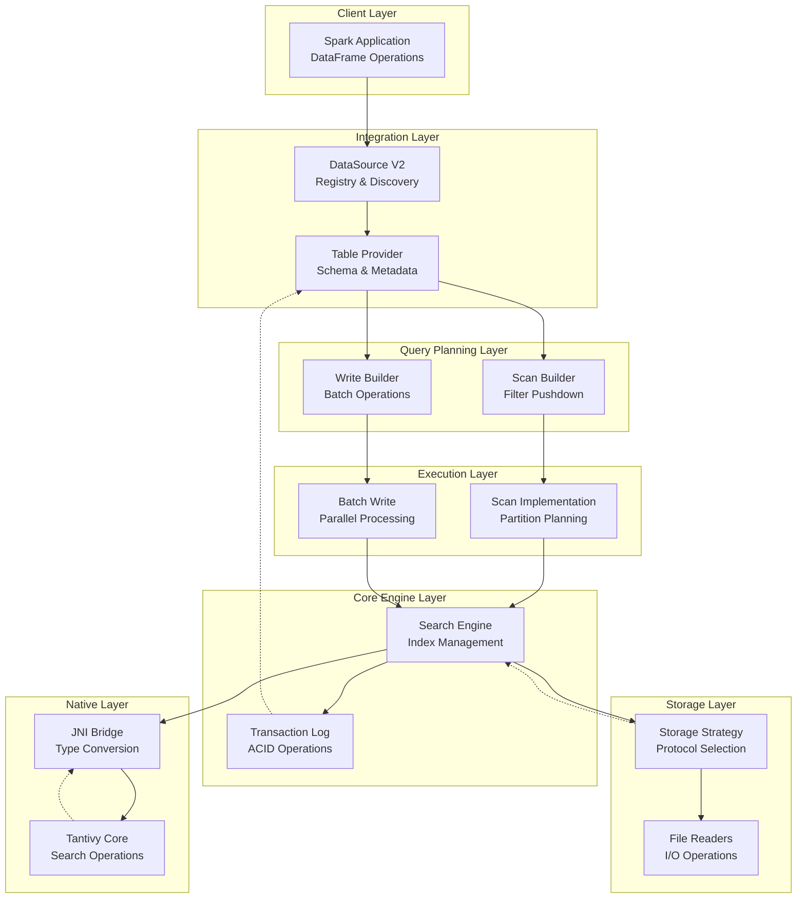

## Data Flow Patterns

### 1. Write Data Flow

#### Document Indexing Pipeline

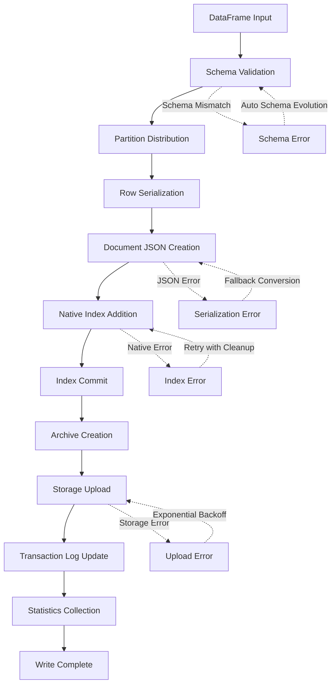

#### Detailed Write Component Interactions

1. **Initial Setup Phase**
   ```
   SparkApp → DataSource.write() → WriteBuilder → BatchWrite
   ```
   - Schema inference and validation
   - Transaction log initialization
   - Partition strategy determination

2. **Per-Partition Processing**
   ```
   BatchWrite → SearchEngine.create() → TantivyNative.createIndex()
   ```
   - Native index creation per partition
   - Schema mapping Spark → Tantivy
   - Index handle registration

3. **Document Processing Loop**
   ```
   For each row:
     RowConverter.toJSON() → SearchEngine.addDocument() → JNI.addDocument()
   ```
   - Row-by-row conversion to JSON
   - Native document addition
   - Incremental statistics collection

4. **Finalization Phase**
   ```
   SearchEngine.commit() → ArchiveFormat.create() → Storage.upload() → TxLog.addFile()
   ```
   - Index commitment and optimization
   - Archive file creation with compression
   - Storage upload with retry logic
   - Transaction log entry creation

### 2. Read Data Flow

#### Query Execution Pipeline

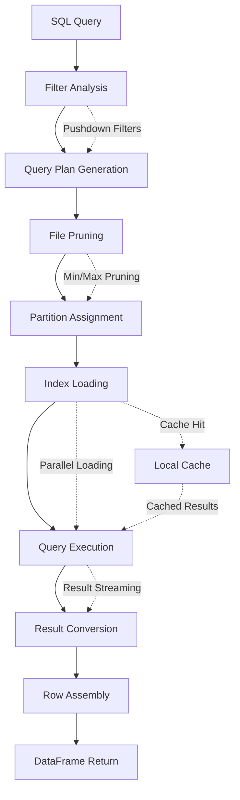

#### Detailed Read Component Interactions

1. **Query Planning Phase**
   ```
   SparkSQL → ScanBuilder.pushFilters() → FiltersToQueryConverter.convert()
   ```
   - Filter pushdown optimization
   - Spark filters → Tantivy query conversion
   - Query optimization and validation

2. **File Discovery Phase**
   ```
   Scan → TransactionLog.listFiles() → Statistics-based pruning
   ```
   - Transaction log reading
   - File metadata extraction
   - Min/max statistics-based pruning

3. **Per-File Processing**
   ```
   For each index file:
     StorageStrategy.read() → SearchEngine.load() → TantivyNative.search()
   ```
   - Optimal storage reader selection
   - Index loading from archive format
   - Native search execution

4. **Result Processing**
   ```
   Native results → RowConverter.fromJSON() → InternalRow assembly
   ```
   - JSON result deserialization
   - Type conversion and validation
   - Spark InternalRow creation

### 3. Storage Access Patterns

#### Intelligent Storage Selection

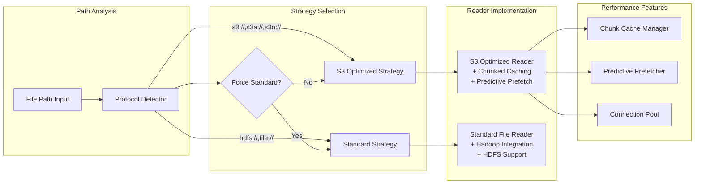

#### Storage Optimization Flows

1. **S3 Optimized Access Pattern**
   ```
   Range Request → Chunk Cache Check → Prefetch Next Chunks → Parallel Downloads
   ```
   - Intelligent chunk-based reading
   - LRU cache with size limits
   - Predictive prefetching based on access patterns
   - Connection pooling for concurrent requests

2. **Standard Hadoop Access Pattern**
   ```
   Path Resolution → FileSystem API → Direct Read → Hadoop Caching
   ```
   - Standard Hadoop FileSystem abstraction
   - Built-in Hadoop caching mechanisms
   - Direct file system integration

## Inter-Component Communication

### 1. Synchronous Communication Patterns

#### Direct Method Invocation
```
Component A → Component B.method() → Result/Exception
```

**Examples:**
- `DataSource → TableProvider.getTable()`
- `SearchEngine → TantivyNative.search()`
- `TransactionLog → FileSystem.write()`

#### Request-Response with Error Handling
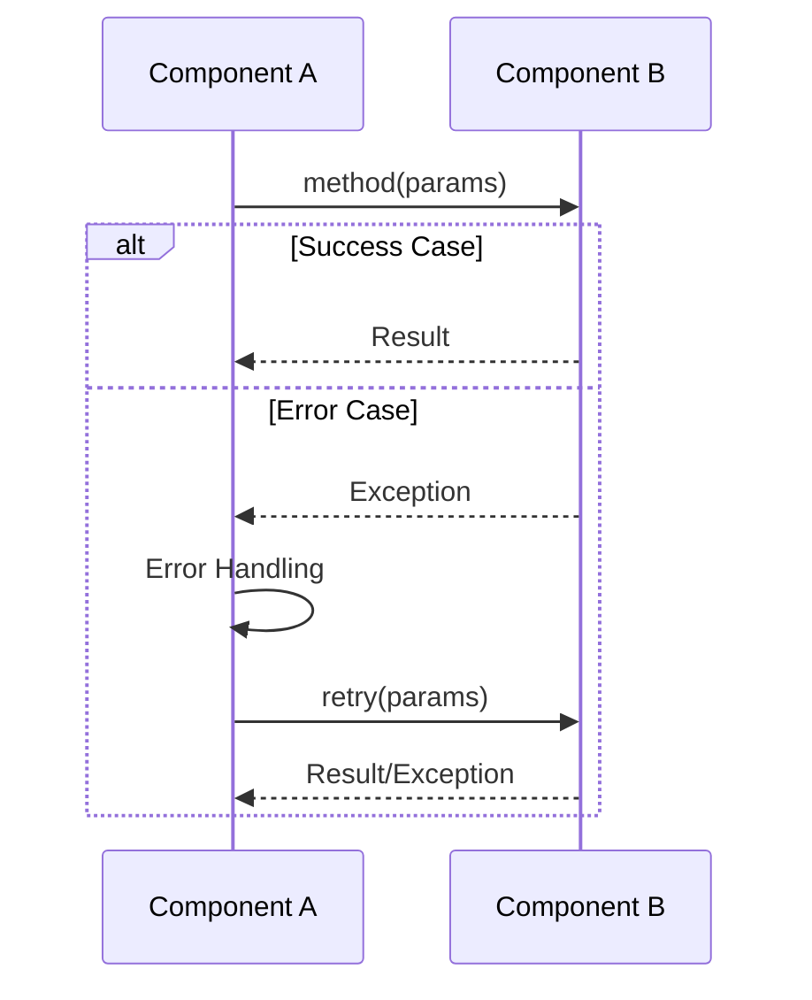

### 2. Asynchronous Communication Patterns

#### Future-Based Operations
```scala
// Example: Parallel index loading
val futures = indexFiles.map { file =>
  Future {
    searchEngine.loadFromArchive(file)
  }
}
val results = Future.sequence(futures)
```

#### Iterator-Based Streaming
```scala
// Example: Streaming search results
def search(query: String): Iterator[InternalRow] = {
  val nativeResults = tantivyNative.search(indexHandle, query)
  nativeResults.map(jsonResult => convertToInternalRow(jsonResult))
}
```

### 3. Event-Driven Patterns

#### Transaction Log Events
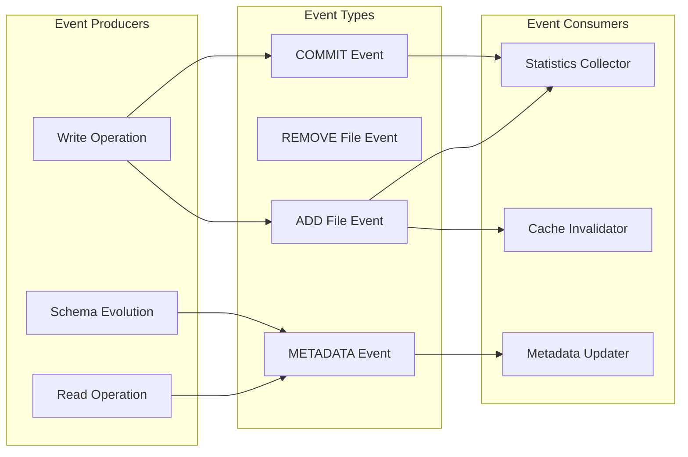

## Error Handling and Recovery

### 1. Error Propagation Hierarchy

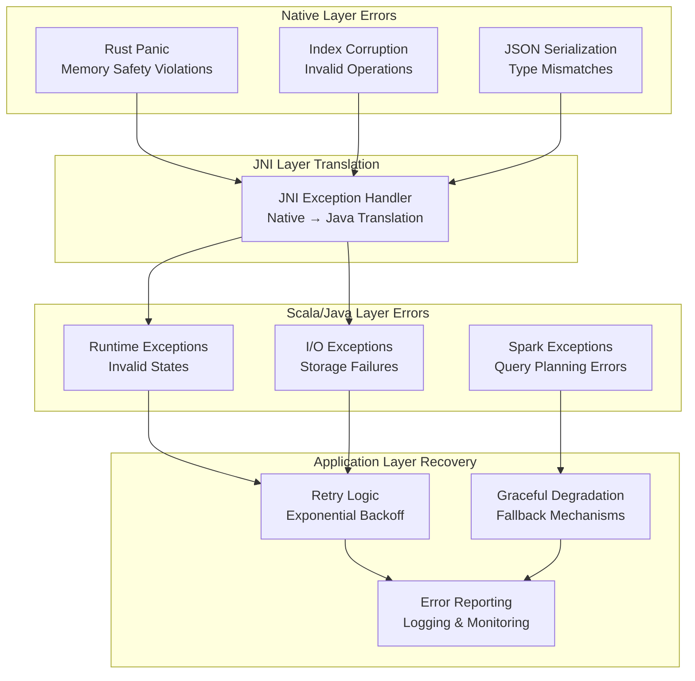

### 2. Recovery Strategies by Component

#### Search Engine Recovery
```scala
// Graceful degradation when native library unavailable
class TantivySearchEngine {
  private val nativeAvailable = TantivyNative.ensureLibraryLoaded()
  
  def search(query: String): Iterator[InternalRow] = {
    if (nativeAvailable) {
      performNativeSearch(query)
    } else {
      // Fallback to all-document scan with manual filtering
      performFallbackSearch(query)
    }
  }
}
```

#### Storage Layer Recovery
```scala
// S3 with fallback to standard operations
class S3OptimizedReader {
  def read(path: Path, offset: Long, length: Int): Array[Byte] = {
    try {
      optimizedRangeRead(path, offset, length)
    } catch {
      case _: S3Exception => 
        logger.warn(s"S3 optimization failed for $path, falling back to standard read")
        standardFileRead(path, offset, length)
    }
  }
}
```

#### Transaction Log Recovery
```scala
// Version conflict resolution
class TransactionLog {
  def addFile(action: AddAction): Long = {
    var retries = 0
    while (retries < maxRetries) {
      try {
        val version = getLatestVersion() + 1
        writeAction(version, action)
        return version
      } catch {
        case _: FileAlreadyExistsException =>
          retries += 1
          Thread.sleep(backoffDelay(retries))
      }
    }
    throw new RuntimeException("Failed to add file after max retries")
  }
}
```

## Performance Optimization Flows

### 1. Query Optimization Pipeline

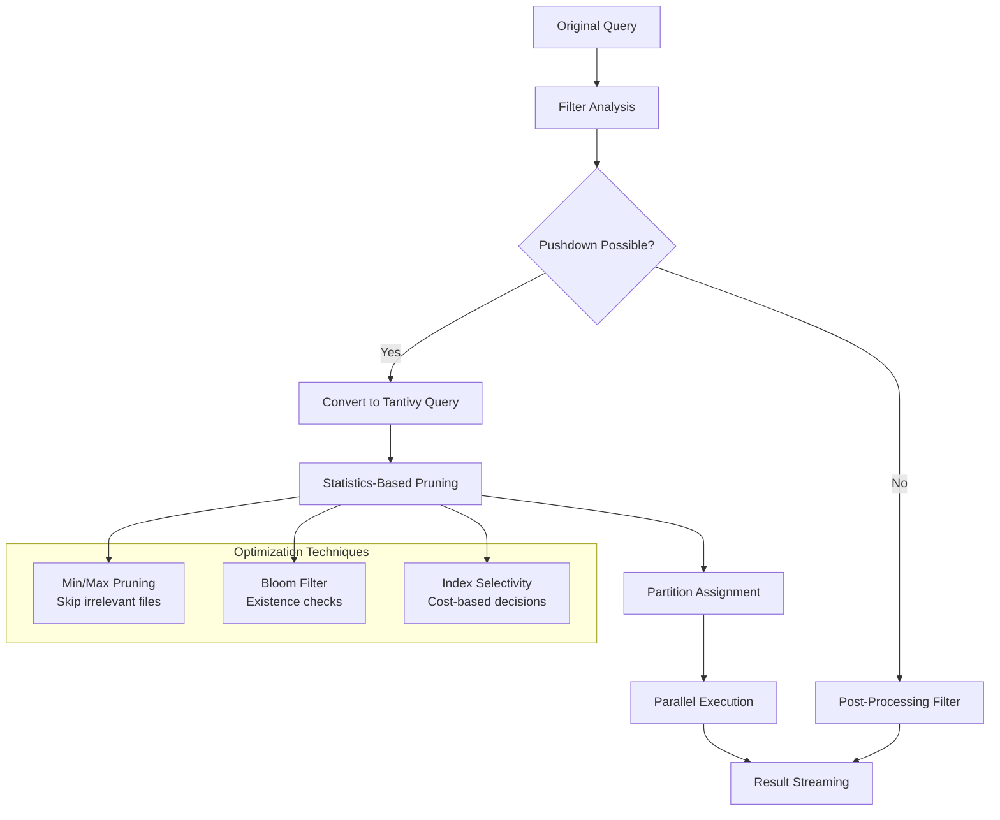

### 2. I/O Optimization Patterns

#### Predictive Caching Flow
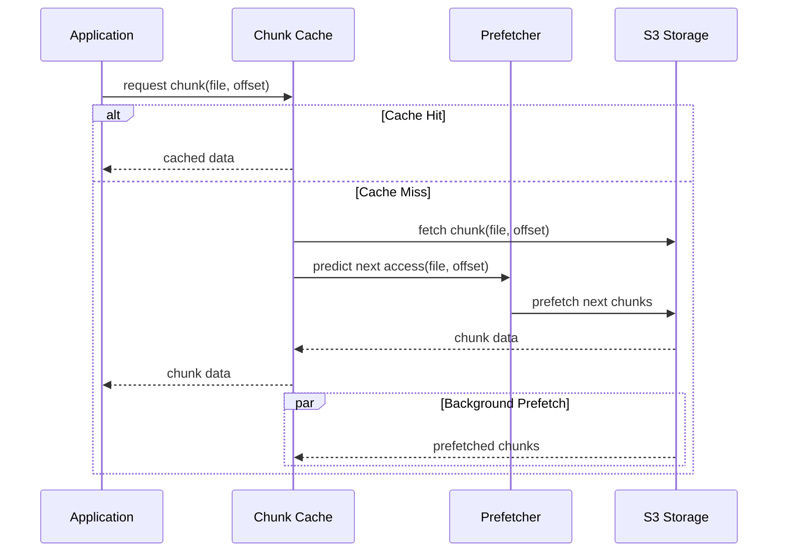

#### Connection Pool Management
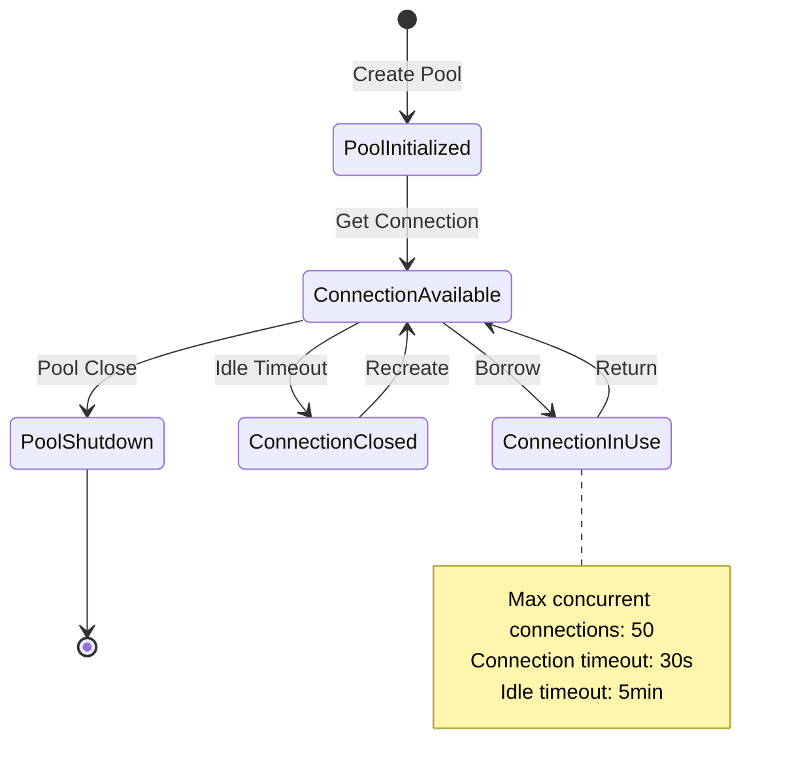

### 3. Memory Management Flows

#### Native Memory Lifecycle
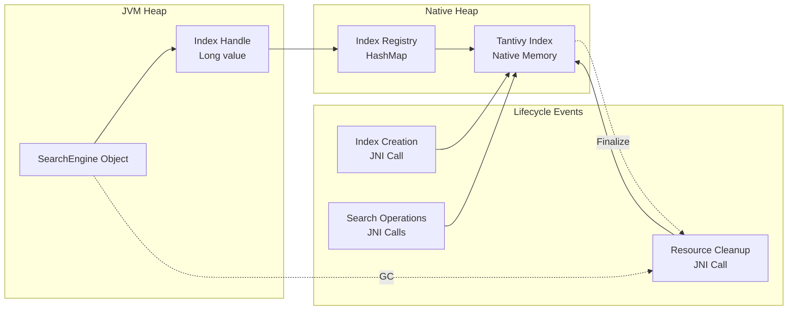

This comprehensive documentation shows how all components interact within the Tantivy4Spark system, providing clear visibility into data flows, communication patterns, and optimization strategies.