# Component Interaction Diagrams

## System Component Overview

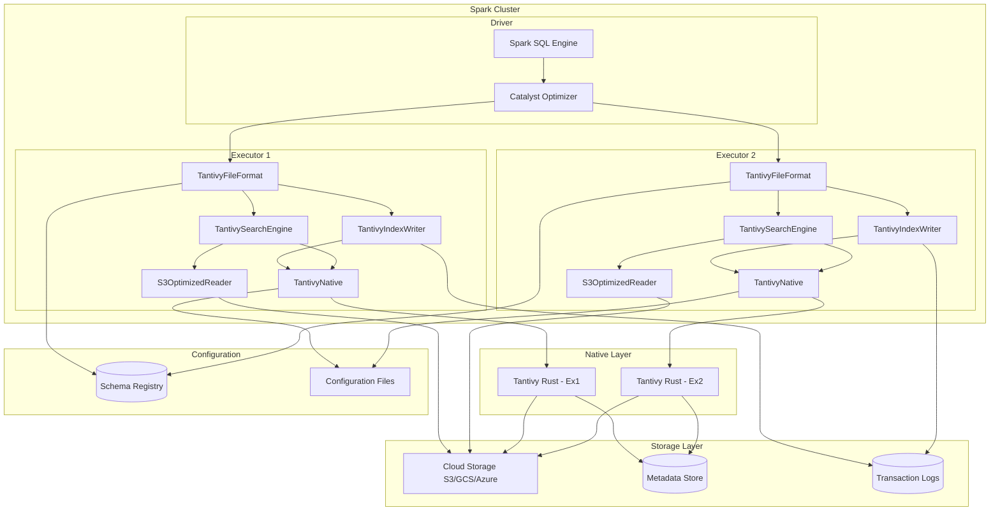

## Data Flow Interaction Patterns

### 1. Write Path Interactions

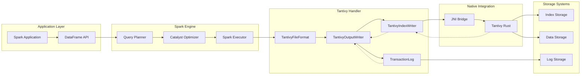

### 2. Read Path Interactions

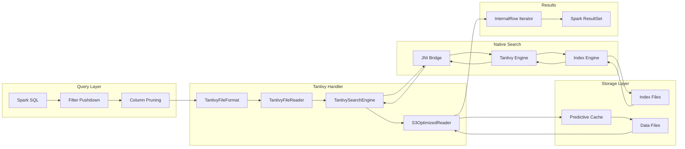

## Component Communication Protocols

### 1. JNI Communication Protocol

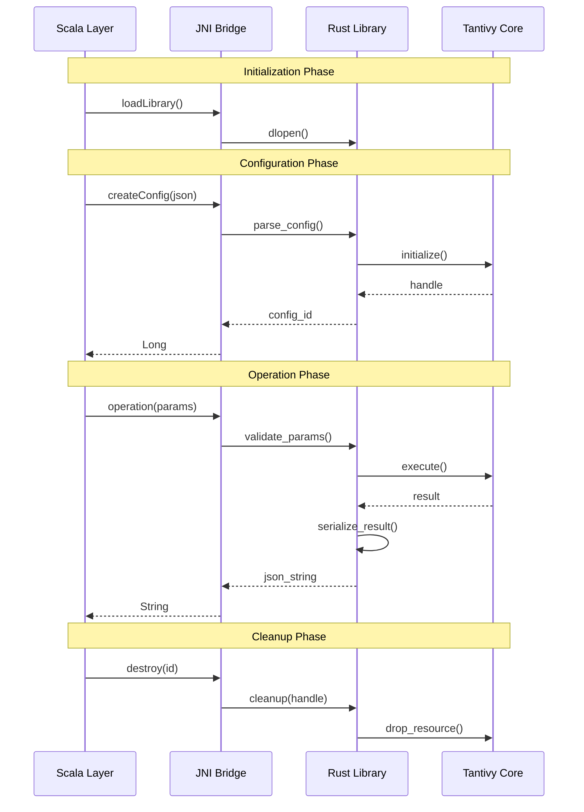

### 2. Cache Interaction Protocol

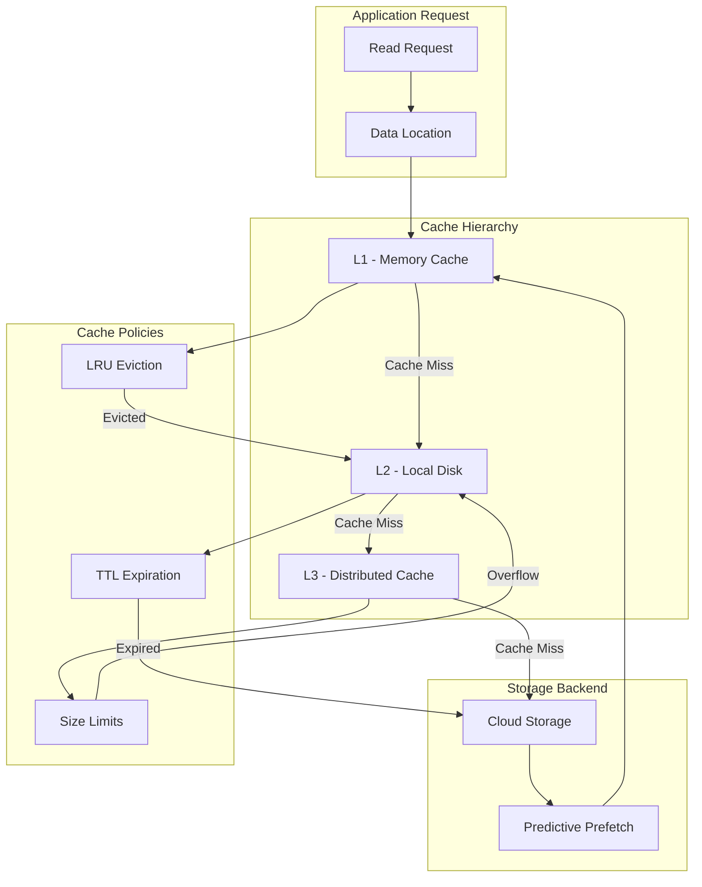

### 3. Transaction Coordination

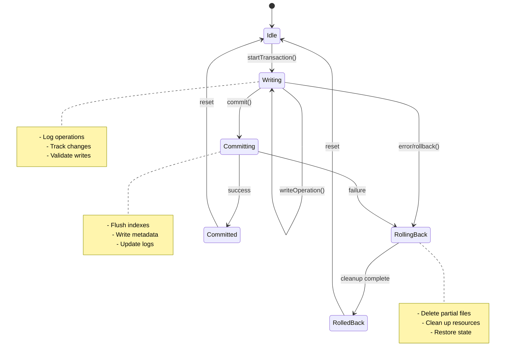

## Cross-Component Dependencies

### 1. Configuration Dependencies

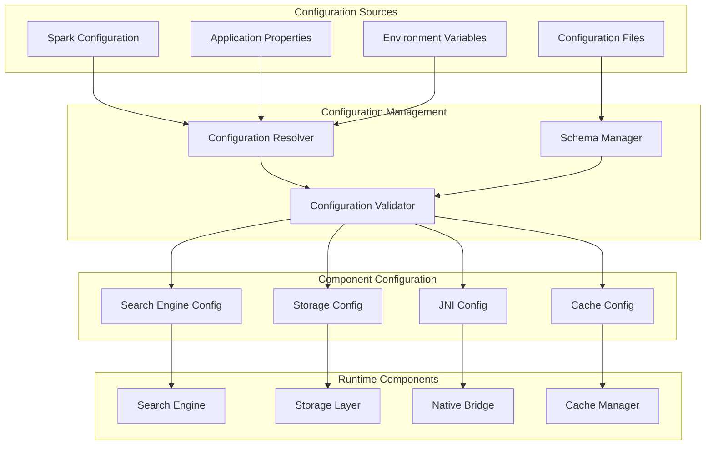

### 2. Error Handling and Recovery

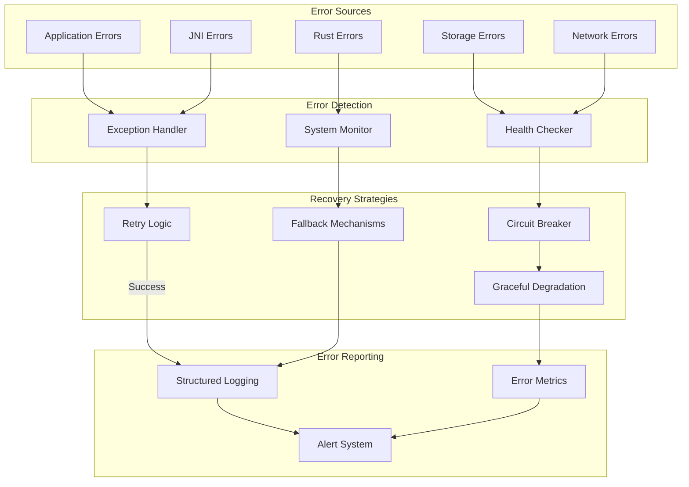

### 3. Resource Management

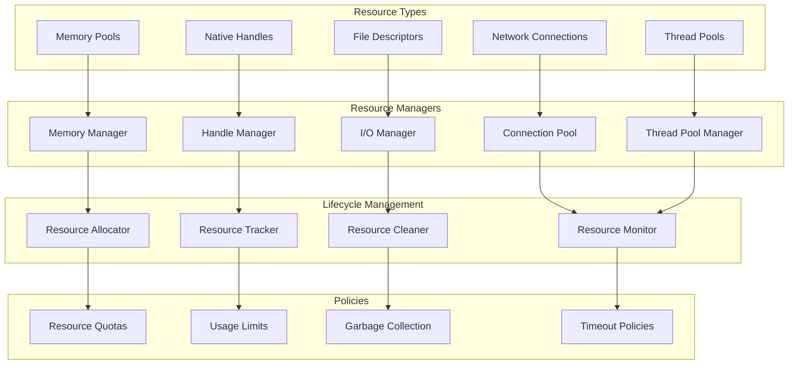

## Performance Optimization Interactions

### 1. Query Optimization Pipeline

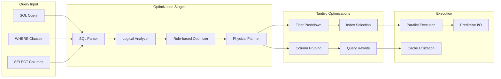

### 2. Caching Strategy Coordination

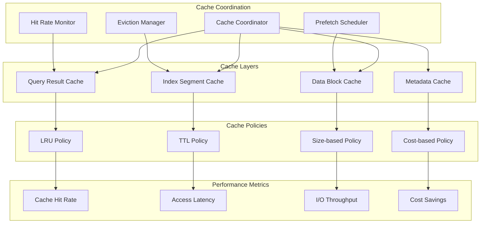