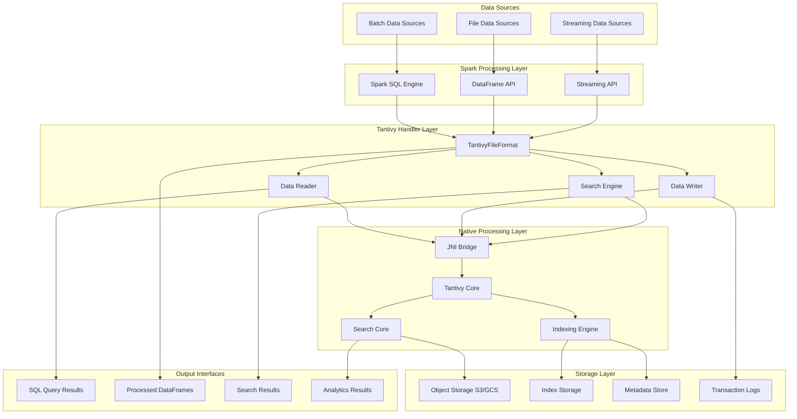
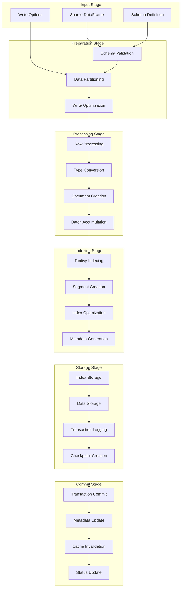
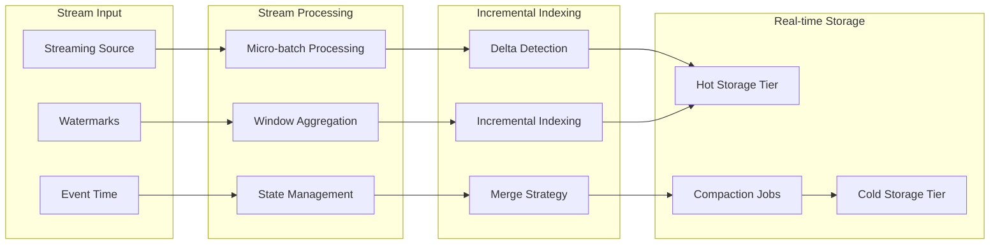
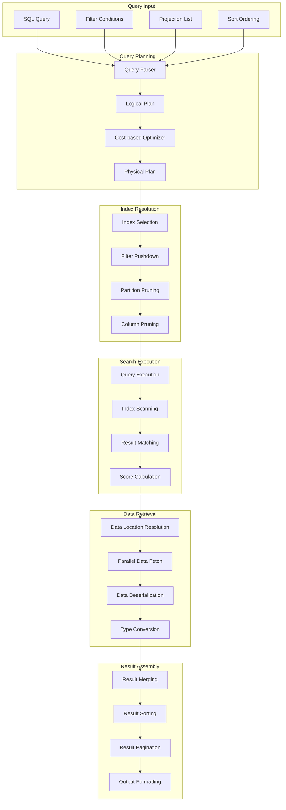
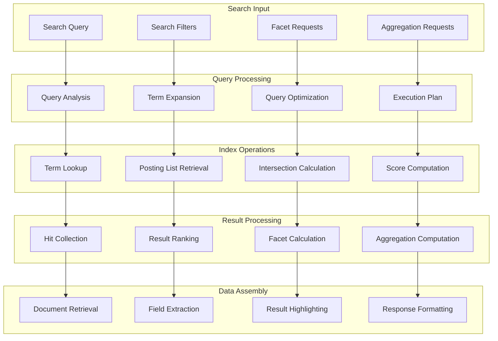
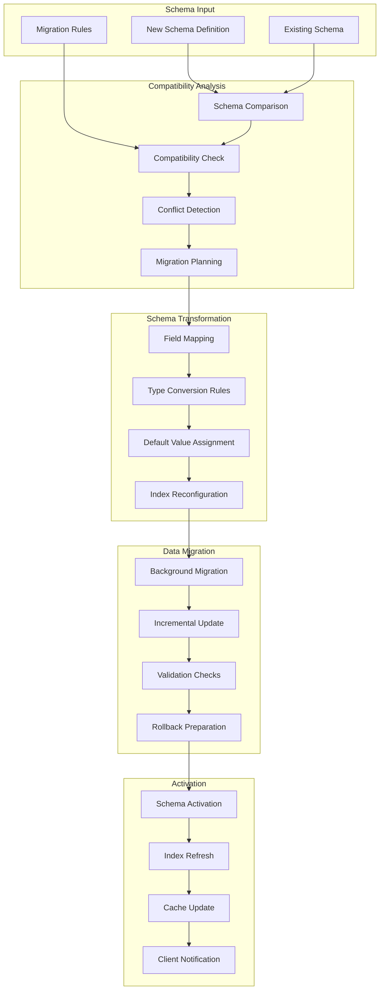
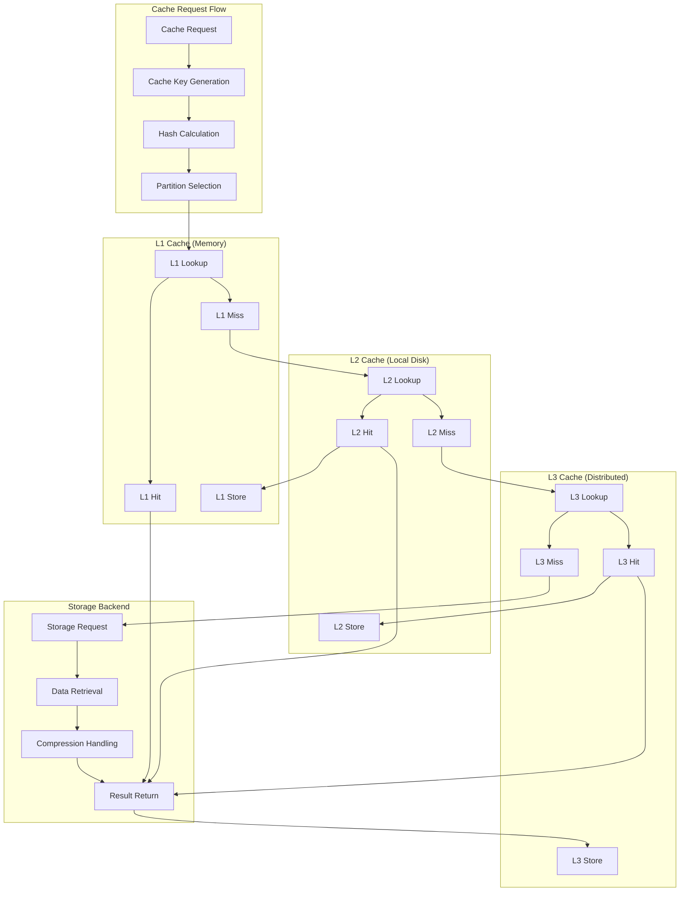
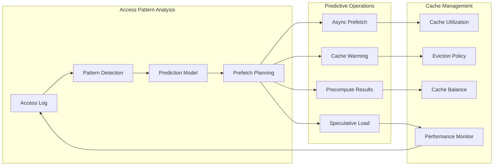
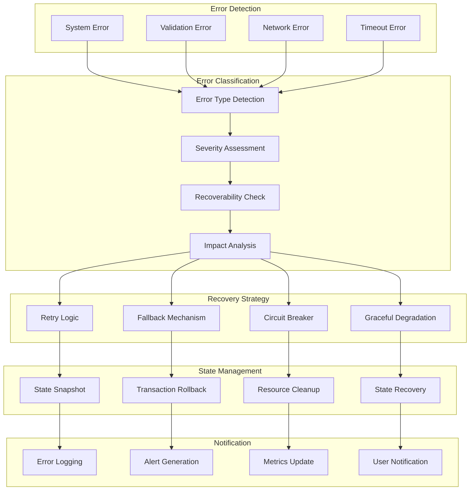
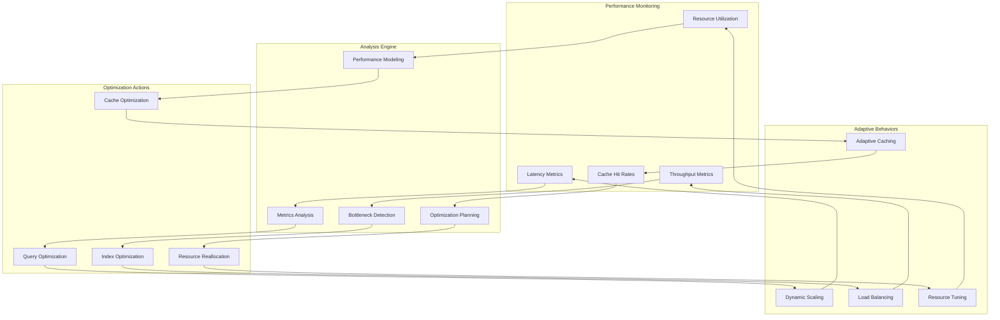

# Data Flow Diagrams - Spark Tantivy Handler

## High-Level Data Flow Architecture

## Write Data Flow

### 1. Batch Write Operations

### 2. Streaming Write Operations

## Read Data Flow

### 1. Query-Driven Read Operations

### 2. Search-Driven Read Operations

## Schema Evolution Data Flow

## Caching Data Flow

### 1. Multi-Level Cache Hierarchy

### 2. Predictive Caching Flow

## Error Handling Data Flow

## Performance Optimization Data Flow

