# Deployment Architecture - Spark Tantivy Handler

## Deployment Overview

The Spark Tantivy Handler can be deployed in various configurations to meet different performance, scalability, and operational requirements. This document outlines the primary deployment patterns and architectural considerations.

## Deployment Topologies

### 1. Single-Node Development Deployment

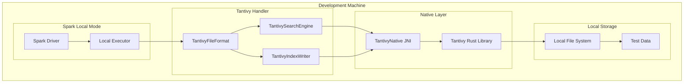

**Use Cases:**
- Development and testing
- Proof of concept implementations
- Small dataset experimentation
- Feature development and debugging

**Configuration:**
```properties
spark.master=local[*]
spark.serializer=org.apache.spark.serializer.KryoSerializer
tantivy.base.path=./local-tantivy-data
storage.uri=file://./data
```

### 2. Standalone Cluster Deployment

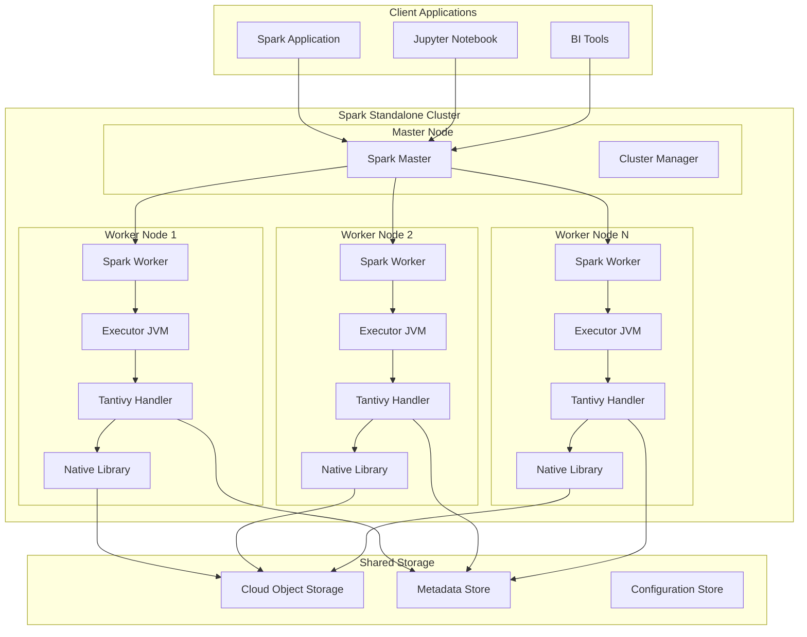

**Use Cases:**
- Production workloads with dedicated infrastructure
- On-premises deployments
- Complete control over cluster configuration
- Custom security and networking requirements

### 3. Kubernetes Deployment

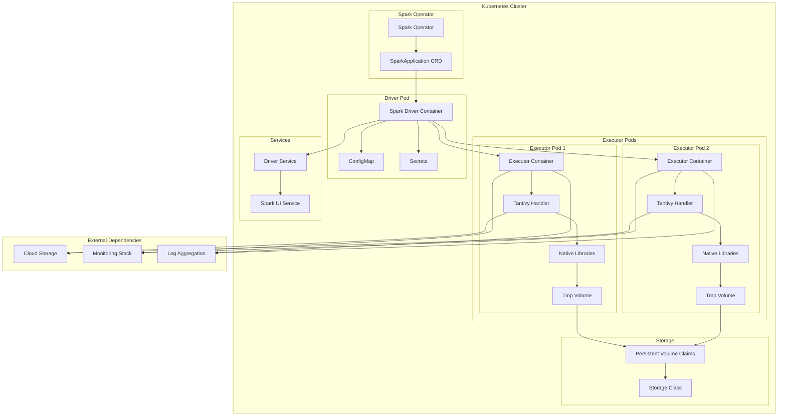

**Kubernetes Manifest Example:**
```yaml
apiVersion: sparkoperator.k8s.io/v1beta2
kind: SparkApplication
metadata:
  name: tantivy-spark-job
spec:
  type: Scala
  mode: cluster
  image: "tantivy-spark:latest"
  imagePullPolicy: Always
  mainClass: com.example.TantivySparkApp
  mainApplicationFile: "local:///opt/spark/jars/tantivy-spark-handler.jar"
  sparkVersion: "3.4.1"
  driver:
    cores: 1
    coreLimit: "1200m"
    memory: "2g"
    serviceAccount: spark-driver
  executor:
    cores: 2
    instances: 4
    memory: "4g"
    serviceAccount: spark-executor
  volumes:
    - name: native-libs
      emptyDir: {}
  volumeMounts:
    - name: native-libs
      mountPath: /tmp/native-libs
```

### 4. Cloud-Managed Deployments

#### AWS EMR Deployment

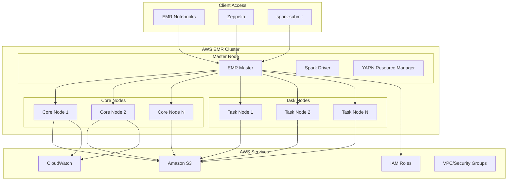

#### Databricks Deployment

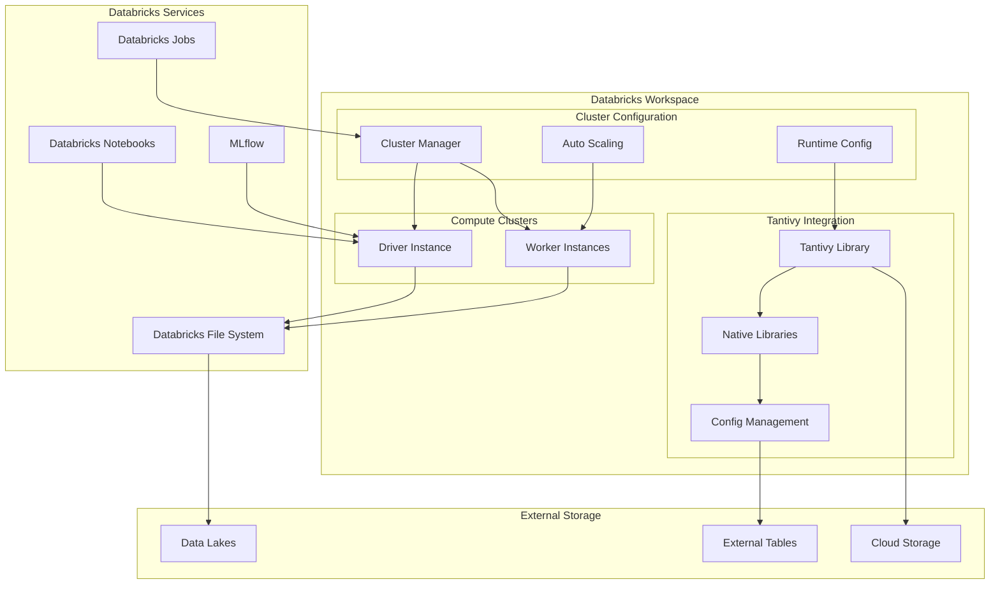

## Container Images and Packaging

### 1. Base Container Image Structure

```dockerfile
# Multi-stage build for Tantivy Spark Handler
FROM rust:1.70 AS rust-builder

# Build native Tantivy library
WORKDIR /build
COPY src/main/rust/ .
RUN cargo build --release

FROM openjdk:11-jre-slim AS java-builder

# Install Scala and SBT
RUN apt-get update && apt-get install -y curl
RUN curl -L https://github.com/coursier/launchers/raw/master/scala-cli.sh | bash

# Build Scala application
WORKDIR /build
COPY pom.xml .
COPY src/ src/
RUN mvn clean package -DskipTests

FROM apache/spark:3.4.1-scala2.12-java11-python3-ubuntu

# Copy native libraries
COPY --from=rust-builder /build/target/release/libtantivy_jni.so /opt/spark/native/
COPY --from=rust-builder /build/target/release/libtantivy_jni.dylib /opt/spark/native/
COPY --from=rust-builder /build/target/release/tantivy_jni.dll /opt/spark/native/

# Copy JAR files
COPY --from=java-builder /build/target/tantivy-spark-handler-*.jar /opt/spark/jars/

# Set environment variables
ENV QUICKWIT_NATIVE_LIB_PATH=/opt/spark/native
ENV LD_LIBRARY_PATH=/opt/spark/native:$LD_LIBRARY_PATH

# Create non-root user
RUN groupadd -r tantivy && useradd -r -g tantivy tantivy
USER tantivy

ENTRYPOINT ["/opt/entrypoint.sh"]
```

### 2. Multi-Architecture Support

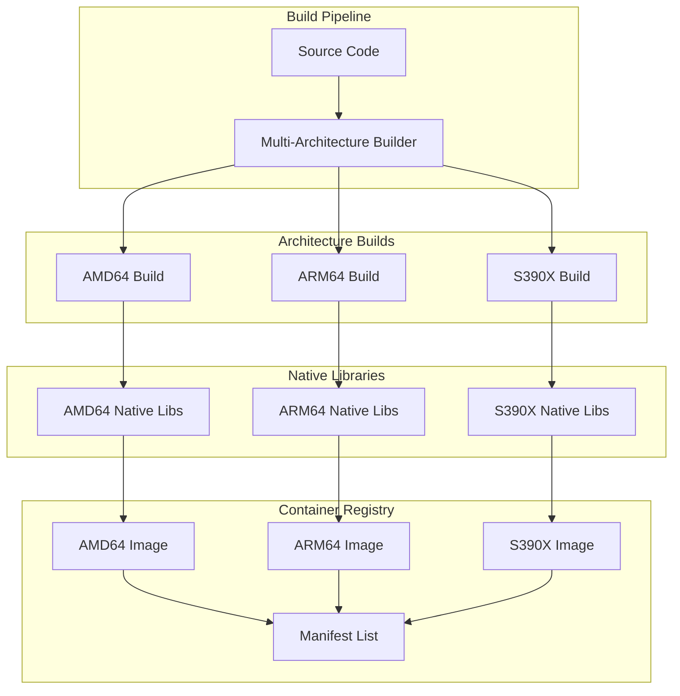

## Security Architecture

### 1. Security Layers

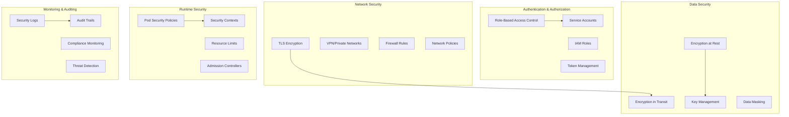

### 2. Secrets Management

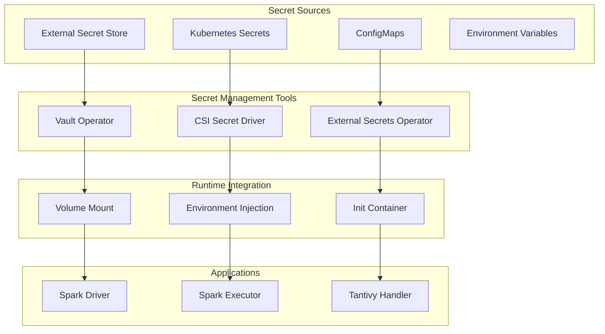

## Performance and Scaling Considerations

### 1. Horizontal Scaling Pattern

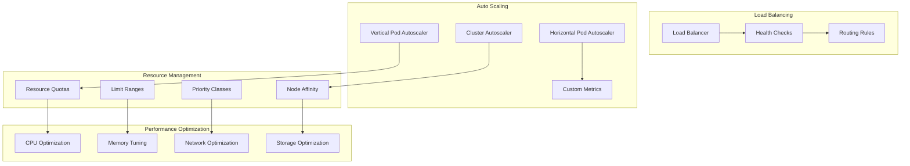

### 2. Resource Allocation Strategy

```yaml
# Resource allocation configuration
apiVersion: v1
kind: ConfigMap
metadata:
  name: tantivy-resource-config
data:
  driver-resources.yaml: |
    spark.driver.cores: 2
    spark.driver.memory: 4g
    spark.driver.memoryFraction: 0.8
    spark.driver.maxResultSize: 2g
    
  executor-resources.yaml: |
    spark.executor.cores: 4
    spark.executor.memory: 8g
    spark.executor.memoryFraction: 0.8
    spark.executor.instances: auto
    
  tantivy-config.yaml: |
    tantivy.jni.memory.max: 2g
    tantivy.cache.size: 1g
    tantivy.batch.size: 1000
    tantivy.segment.size: 128MB
```

## Monitoring and Observability

### 1. Metrics Collection Architecture

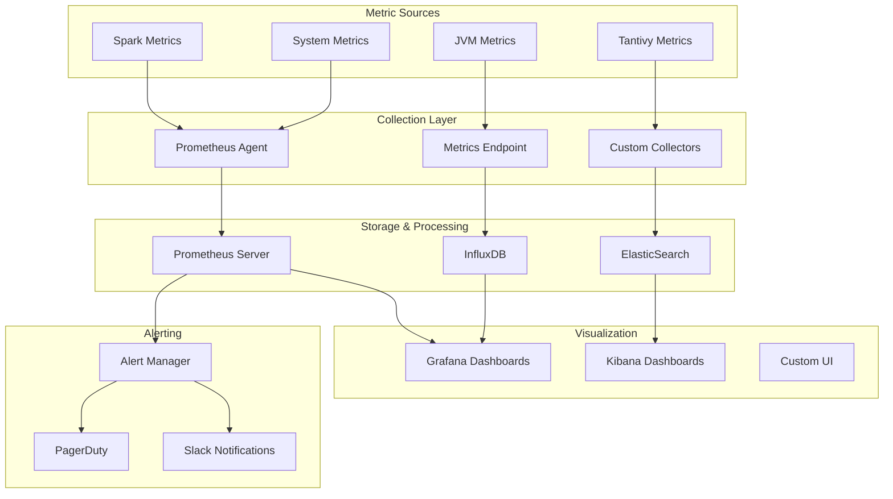

### 2. Logging Architecture

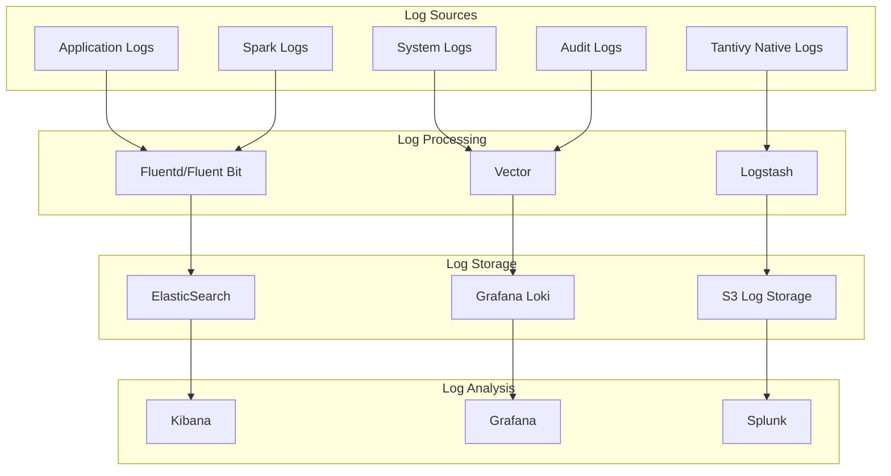

## Disaster Recovery and Backup

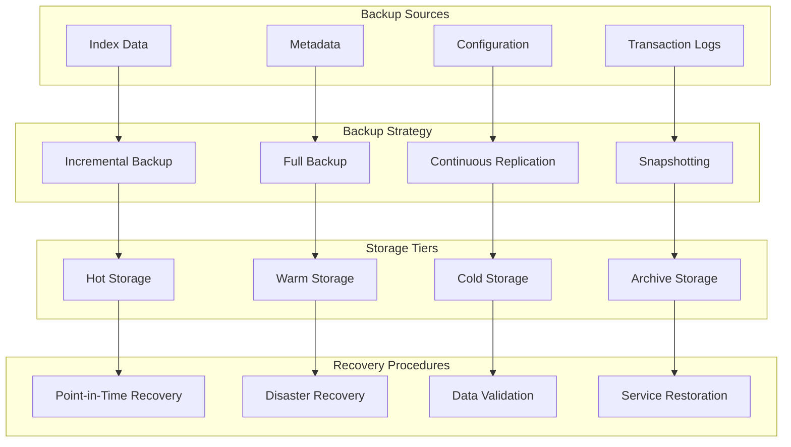

This deployment architecture provides comprehensive guidance for deploying the Spark Tantivy Handler across various environments while maintaining security, performance, and operational excellence.