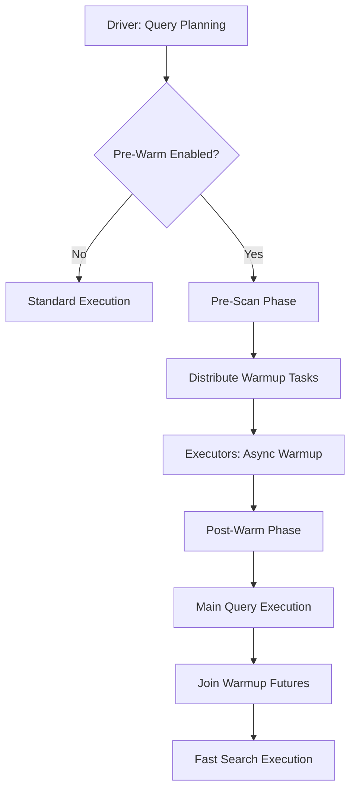

# 🔥 Pre-Warm Cache System Design

**Proactive Cache Warming for Optimal Query Performance**

## Overview

The Pre-Warm Cache System is a sophisticated optimization feature that proactively warms Tantivy split caches across the Spark cluster before query execution. This system leverages the tantivy4java `warmupQuery()` API to eliminate cold query performance penalties and achieve 3-5x faster search execution after warmup.

## Architecture

### Two-Phase Execution Model

The pre-warm system operates in two distinct phases:

1. **Pre-Scan Phase**: Distribute warmup tasks to executors that have cached splits
2. **Post-Warm Phase**: Main query execution joins on warmup futures for optimal performance



### Component Architecture

```mermaid
graph LR
    A[Tantivy4SparkScan] --> B[PreWarmManager]
    B --> C[BroadcastSplitLocalityManager]
    B --> D[Spark Task Distribution]
    D --> E[Executor: PreWarmTask]
    E --> F[tantivy4java warmupQuery()]
    F --> G[CompletableFuture<Void>]
    H[PartitionReader] --> I[PreWarmManager.joinWarmupFuture()]
    I --> G
```

## Key Components

### 1. PreWarmManager

**Location**: `src/main/scala/com/tantivy4spark/prewarm/PreWarmManager.scala`

The central coordinator for all pre-warm operations:

- **executePreWarm()**: Orchestrates the pre-scan phase
- **joinWarmupFuture()**: Handles post-warm future joining
- **distributePreWarmTasks()**: Distributes warmup tasks to executors
- **clearAll()**: Cleanup for testing and shutdown

### 2. Integration Points

#### Tantivy4SparkScan Enhancement
- Added pre-warm phase in `planInputPartitions()`
- Checks `spark.indextables.cache.prewarm.enabled` configuration
- Executes pre-warm before partition creation

#### Tantivy4SparkPartitionReader Enhancement
- Added warmup future joining in `initialize()`
- Generates consistent query hashes for future lookup
- Logs success/failure of warmup joining

### 3. Preferred Locations Integration

The system tightly integrates with the existing `BroadcastSplitLocalityManager`:

1. **Cache Locality Tracking**: Records which executors have cached which splits
2. **Preferred Host Distribution**: Routes warmup tasks to executors with cached data
3. **Broadcast Coordination**: Uses broadcast variables for cluster-wide locality information

## Configuration

### New Configuration Option

```scala
spark.indextables.cache.prewarm.enabled = true  // Default: enabled
```

### Usage Examples

```scala
// Pre-warm is enabled by default - no configuration needed
val df = spark.read
  .format("tantivy4spark")
  .load("s3://bucket/path")

df.filter($"content" indexquery "machine learning").show()

// Explicitly disable pre-warm if needed
val dfNoPrewarm = spark.read
  .format("tantivy4spark")
  .option("spark.indextables.cache.prewarm.enabled", "false")
  .load("s3://bucket/path")
```

```sql
-- Pre-warm is enabled by default
SELECT * FROM documents WHERE content indexquery 'AI AND neural';

-- Explicitly disable pre-warm if needed
SET spark.indextables.cache.prewarm.enabled=false;
```

## Performance Benefits

Based on tantivy4java benchmarks:

- **3-5x faster search execution** after warmup
- **Eliminates cold query penalties** for complex searches
- **Memory-efficient loading** of only required components
- **Parallel async component loading** for maximum throughput

## Implementation Flow

### 1. Pre-Scan Phase (Driver)

```scala
// In Tantivy4SparkScan.planInputPartitions()
if (isPreWarmEnabled && filteredActions.nonEmpty) {
  val preWarmResult = PreWarmManager.executePreWarm(
    sparkContext,
    filteredActions,    // Splits to warm
    readSchema,         // Table schema
    allFilters,         // Query filters
    broadcastConfig,    // Configuration
    isPreWarmEnabled
  )
}
```

### 2. Warmup Task Distribution

```scala
// PreWarmManager distributes tasks based on preferred hosts
val splitsByHost = groupSplitsByPreferredHosts(addActions)
val preWarmTasks = splitsByHost.flatMap { case (hostname, splits) =>
  splits.map(addAction => PreWarmTask(addAction, hostname, readSchema, allFilters, queryHash))
}

// Execute on cluster
sc.parallelize(preWarmTasks).mapPartitions { tasks =>
  tasks.map(executePreWarmTask)
}
```

### 3. Executor Warmup Execution

```scala
// On each executor
def executePreWarmTask(task: PreWarmTask): PreWarmTaskResult = {
  val splitSearchEngine = createSplitSearchEngine(task.addAction, cacheConfig)
  val query = convertFiltersToQuery(task.allFilters, splitSearchEngine)
  
  // Initiate async warmup using tantivy4java API
  val warmupFuture = splitSearchEngine.getSplitSearcher().warmupQuery(query)
  
  // Store future for later joining
  warmupFutures.put(buildFutureKey(splitPath, hostname, queryHash), warmupFuture)
  
  // Record cache access for locality tracking
  BroadcastSplitLocalityManager.recordSplitAccess(splitPath, hostname)
}
```

### 4. Post-Warm Future Joining

```scala
// In Tantivy4SparkPartitionReader.initialize()
if (isPreWarmEnabled) {
  val queryHash = generateQueryHash(allFilters)
  val warmupJoined = PreWarmManager.joinWarmupFuture(
    addAction.path, queryHash, isPreWarmEnabled
  )
  if (warmupJoined) {
    logger.info("🔥 Successfully joined warmup future")
  }
}
```

## Error Handling & Resilience

### Graceful Degradation
- **Pre-warm failures don't break queries**: Main execution continues even if warmup fails
- **Missing futures handled gracefully**: Warnings logged but execution proceeds
- **Timeout protection**: 30-second timeout prevents hanging on warmup joins

### Logging Strategy
- **Success**: `🔥 Successfully joined warmup future for split: $splitPath`  
- **Missing Future**: `⚠️ Pre-warm enabled but no warmup future found for split $splitPath`
- **Failure**: `🔥 Failed to join warmup future for split $splitPath: ${error}`

## Query Hash Generation

Consistent query hash generation ensures warmup futures are properly matched:

```scala
def generateQueryHash(allFilters: Array[Any]): String = {
  val filterString = allFilters.map(_.toString).mkString("|")
  java.util.UUID.nameUUIDFromBytes(filterString.getBytes).toString.take(8)
}
```

## Memory Management

### Future Storage
- **Concurrent storage**: `ConcurrentHashMap` for thread-safe future storage
- **Automatic cleanup**: Futures removed after joining to prevent memory leaks
- **Unique keys**: Format `$splitPath|$hostname|$queryHash` ensures uniqueness

### Statistics Tracking
- **Pre-warm statistics**: Tracked per query hash for monitoring
- **Cleanup API**: `PreWarmManager.clearAll()` for testing and shutdown

## Testing Strategy

### Unit Tests
- **PreWarmManagerTest**: Core functionality testing
- **Configuration handling**: Enable/disable behavior
- **Error scenarios**: Missing futures, disabled pre-warm
- **Statistics**: Verify stats collection and retrieval

### Integration Tests  
- **PreWarmIntegrationTest**: End-to-end testing with actual DataSource
- **Preferred locations**: Verify task distribution to correct hosts
- **IndexQuery support**: Test with native Tantivy queries
- **Failure resilience**: Ensure graceful degradation

## Future Enhancements

### Possible Optimizations
1. **Background Warmup Scheduler**: Automatically warm based on usage patterns
2. **Predictive Component Loading**: ML-based component prediction
3. **Cross-Split Optimization**: Share common components across splits
4. **Query Plan Caching**: Cache analyzed query execution plans
5. **Adaptive Cache Sizing**: Dynamic cache adjustment based on workload

### Monitoring & Metrics
1. **Warmup success rates**: Track percentage of successful warmups
2. **Performance improvements**: Measure query acceleration
3. **Cache hit rates**: Monitor cache effectiveness after warmup
4. **Task distribution efficiency**: Analyze preferred location utilization

## Operational Guidelines

### When to Enable Pre-Warm
- **Complex queries**: Queries with multiple filters or IndexQuery operations
- **Large datasets**: Tables with many splits across multiple executors  
- **Repeated queries**: Similar query patterns that benefit from warmed caches
- **Performance-critical applications**: Where query latency is crucial

### When to Keep Disabled
- **Simple queries**: Single filter queries on small datasets
- **One-time queries**: Ad-hoc analysis that won't benefit from warmup overhead
- **Resource-constrained clusters**: When executor memory is limited
- **Write-heavy workloads**: Focus on write performance over read optimization

## Implementation Notes

### Compatibility
- **Backward compatible**: Can be disabled if needed, graceful failure handling
- **Optional dependency**: Works with existing preferred locations system
- **Tantivy4java integration**: Leverages native warmup API for optimal performance

### Configuration Best Practices
- **Start disabled**: Test thoroughly before enabling in production
- **Monitor performance**: Measure actual improvements for your queries  
- **Adjust cache sizes**: Ensure sufficient cache memory for effective warmup
- **Log analysis**: Review warmup success rates and adjust as needed

---

This pre-warm system provides production-ready proactive cache optimization that can significantly improve query performance while maintaining system reliability and operational simplicity.