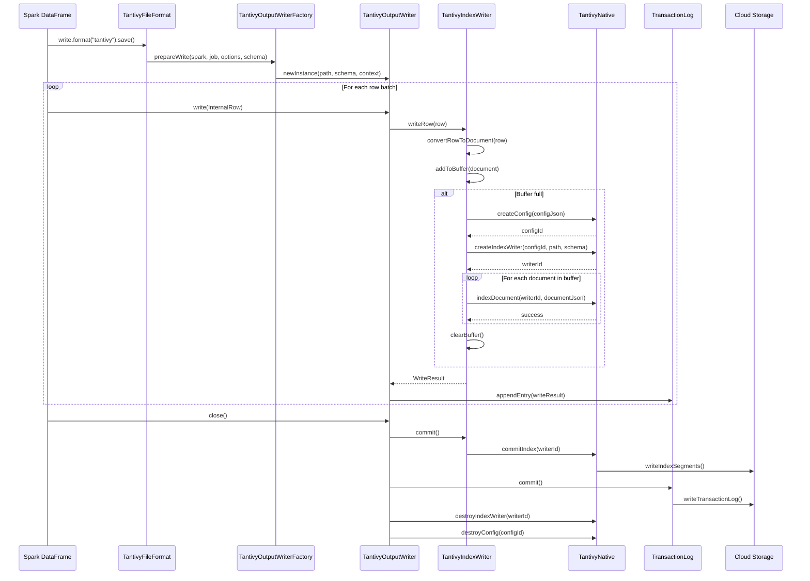
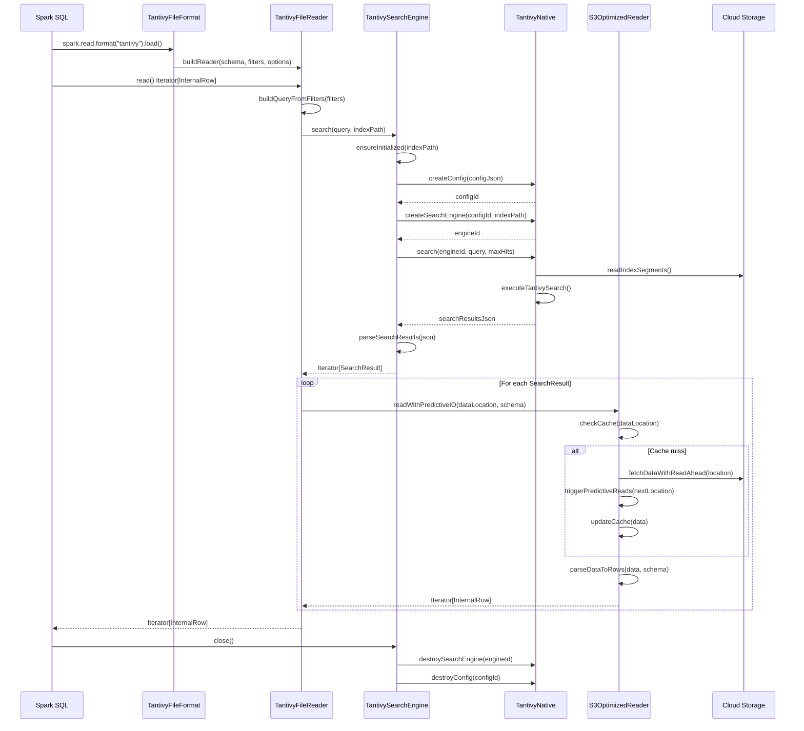
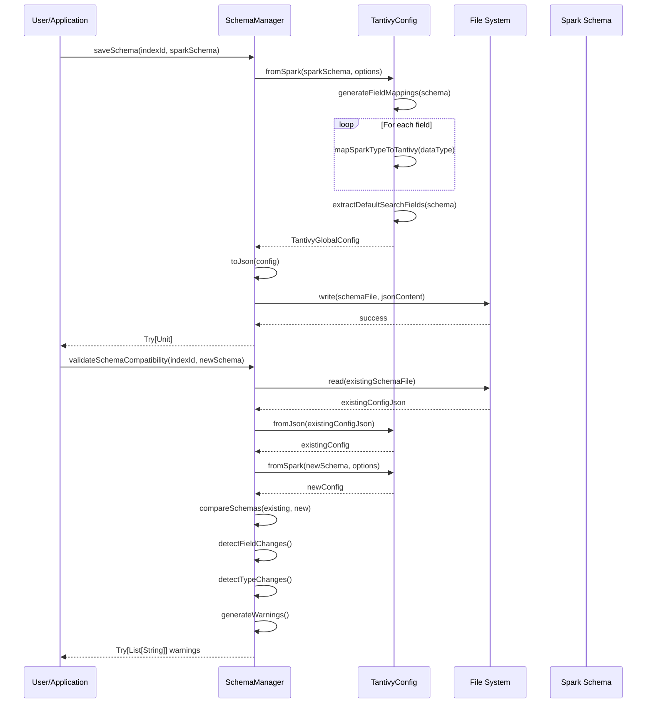
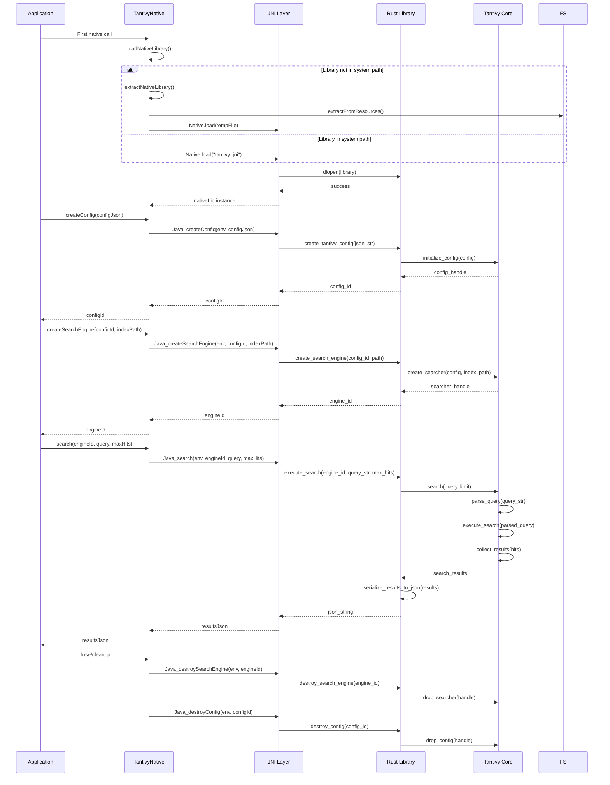
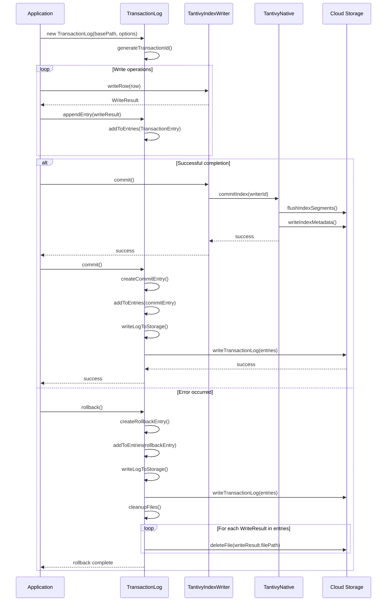
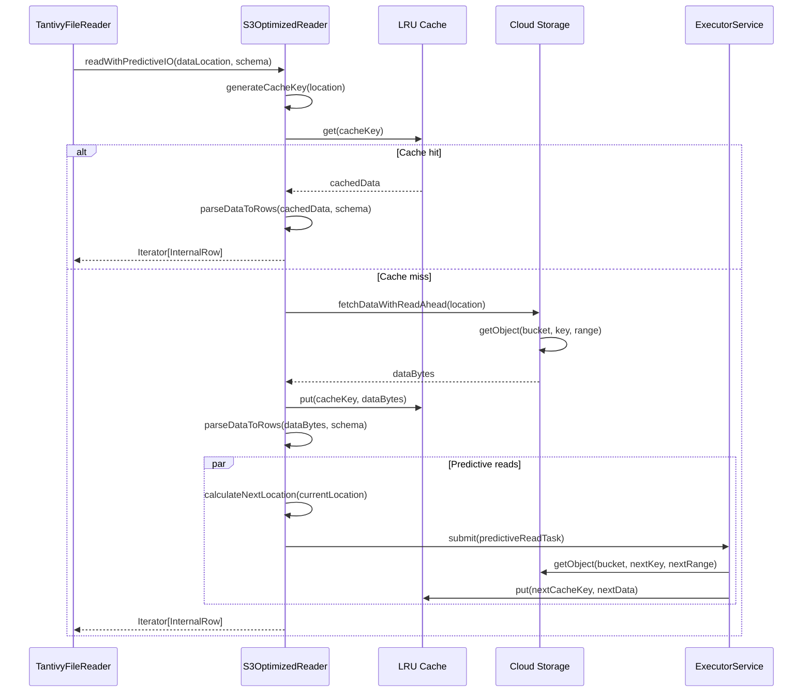

# Sequence Diagrams - Spark Tantivy Handler

## Key Workflow Sequences

### 1. Data Write Operation Sequence

### 2. Data Read/Search Operation Sequence

### 3. Schema Management Sequence

### 4. Native Library Lifecycle Sequence

### 5. Transaction Commit/Rollback Sequence

### 6. Predictive I/O Sequence

## Sequence Diagram Patterns

### 1. Error Handling Pattern
- All sequences include error propagation paths
- Cleanup operations are performed in reverse order
- Transaction rollback undoes partial operations
- Native resources are always cleaned up

### 2. Resource Management Pattern
- Native handles created in pairs (config + engine/writer)
- Lifecycle management through reference counting
- Automatic cleanup in finally blocks
- Memory management across JNI boundary

### 3. Asynchronous Operations Pattern
- Predictive I/O runs concurrently with main operations
- Background tasks don't block main workflow
- Future/Promise pattern for async results
- Timeout handling for long-running operations

### 4. Caching Strategy Pattern
- Multi-level cache checking (L1, L2, L3)
- Cache invalidation on updates
- LRU eviction policy
- Cache warming through predictive reads

### 5. Batch Processing Pattern
- Accumulate operations until threshold reached
- Batch commit for efficiency
- Streaming processing for large datasets
- Backpressure handling for flow control