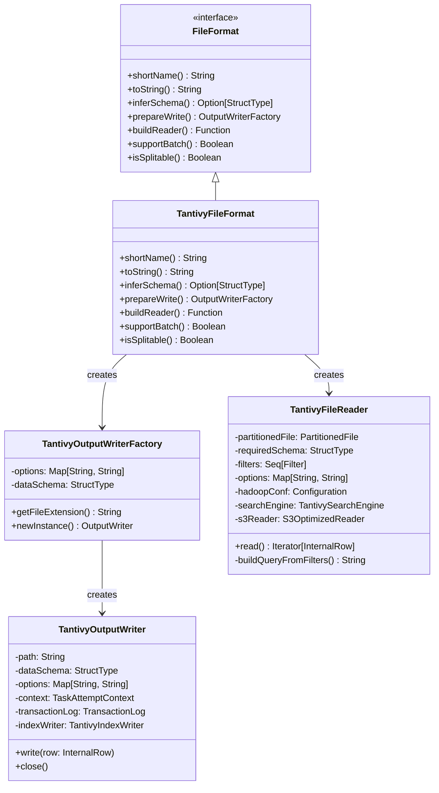
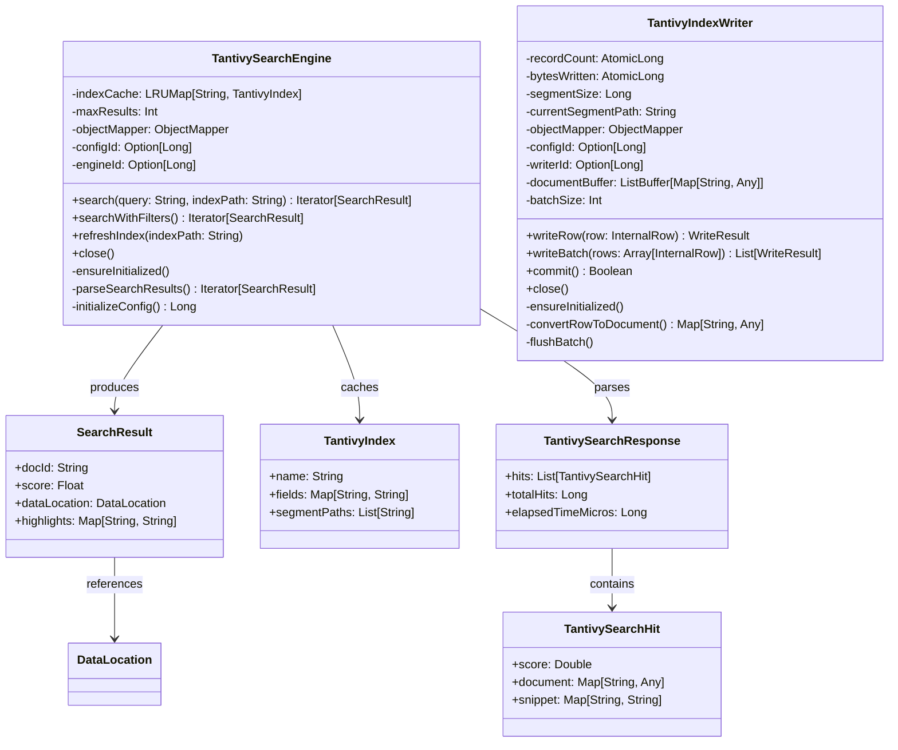
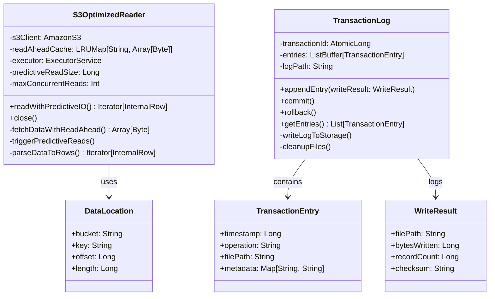
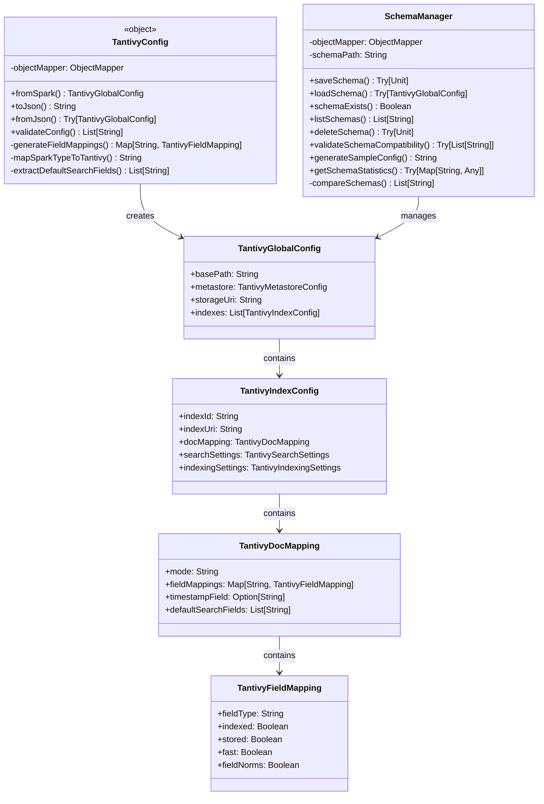
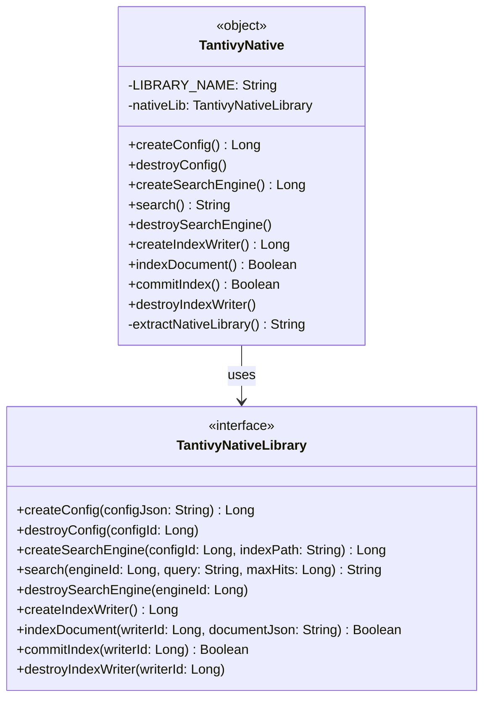
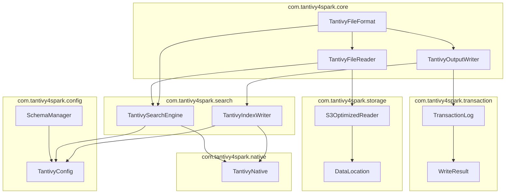

# UML Diagrams - Spark Tantivy Handler

## Class Diagrams

### 1. Core Spark Integration Classes

### 2. Search Engine Classes

### 3. Storage and Transaction Classes

### 4. Configuration Management Classes

### 5. Native Integration Classes

## Package Dependencies

## Class Relationship Summary

### Inheritance Relationships
- `TantivyFileFormat` implements Spark's `FileFormat` interface
- `TantivyNative` implements `TantivyNativeLibrary` interface

### Composition Relationships
- `TantivyFileFormat` creates `TantivyOutputWriterFactory` and `TantivyFileReader`
- `TantivyOutputWriter` contains `TransactionLog` and `TantivyIndexWriter`
- `TantivyFileReader` contains `TantivySearchEngine` and `S3OptimizedReader`
- `TantivySearchEngine` caches `TantivyIndex` objects

### Dependency Relationships
- Search and indexing components depend on `TantivyNative` for JNI operations
- Configuration components provide settings to all other layers
- Storage components are used by both read and write operations
- Transaction logging is integrated into write operations

### Key Design Patterns
- **Factory Pattern**: `TantivyOutputWriterFactory` creates writers
- **Singleton Pattern**: `TantivyNative` object manages native library
- **Observer Pattern**: Transaction logging observes write operations
- **Strategy Pattern**: Different storage strategies for various cloud providers
- **Builder Pattern**: Configuration objects built from various sources