# UML Diagrams for IndexTables4Spark

## Table of Contents

1. [Class Diagrams](#class-diagrams)
2. [Sequence Diagrams](#sequence-diagrams)
3. [Component Diagrams](#component-diagrams)
4. [Deployment Diagrams](#deployment-diagrams)

## Class Diagrams

### Core DataSource V2 Implementation


### Search Engine and Native Integration


### Storage Strategy Pattern


### Transaction Log System


## Sequence Diagrams

### Write Operation Sequence


### Read/Search Operation Sequence


### Native Library Loading Sequence


### Transaction Log Versioning Sequence


## Component Diagrams

### High-Level Component Architecture

```mermaid
graph TB
    subgraph "Spark Integration Layer"
        DataSource[DataSource V2<br/>Implementation]
        TableProvider[Table Provider]
        ScanBuilder[Scan Builder]
        WriteBuilder[Write Builder]
    end

    subgraph "Core Engine Layer"
        SearchEngine[Tantivy Search Engine]
        SchemaConv[Schema Converter]
        RowConv[Row Converter]
        FilterConv[Filter Converter]
    end

    subgraph "Storage Abstraction Layer"
        StorageFactory[Storage Factory]
        S3Reader[S3 Optimized Reader]
        StdReader[Standard File Reader]
        CacheManager[Chunk Cache Manager]
    end

    subgraph "Transaction Management Layer"
        TxLog[Transaction Log]
        Actions[Action Types]
        Statistics[Statistics Manager]
    end

    subgraph "Native Integration Layer"
        JNIBridge[JNI Bridge]
        NativeLib[Native Library Loader]
        IndexManager[Index Manager<br/>(Rust)]
        TantivyCore[Tantivy Core<br/>(Rust)]
    end

    subgraph "Archive & Serialization"
        ArchiveFormat[Archive Format]
        Compression[Compression Utils]
        Serialization[JSON Serialization]
    end

    %% Connections
    DataSource --> TableProvider
    TableProvider --> ScanBuilder
    TableProvider --> WriteBuilder
    ScanBuilder --> SearchEngine
    WriteBuilder --> SearchEngine

    SearchEngine --> SchemaConv
    SearchEngine --> RowConv
    ScanBuilder --> FilterConv
    SearchEngine --> JNIBridge

    SearchEngine --> StorageFactory
    StorageFactory --> S3Reader
    StorageFactory --> StdReader
    S3Reader --> CacheManager

    SearchEngine --> TxLog
    TxLog --> Actions
    TxLog --> Statistics
    TxLog --> ArchiveFormat

    JNIBridge --> NativeLib
    JNIBridge --> IndexManager
    IndexManager --> TantivyCore

    ArchiveFormat --> Compression
    TxLog --> Serialization
    SearchEngine --> Serialization
```

### Storage Layer Component Detail

```mermaid
graph LR
    subgraph "Storage Strategy Pattern"
        Factory[Protocol Based<br/>IO Factory]
        S3Strategy[S3 Storage<br/>Strategy]
        StdStrategy[Standard Storage<br/>Strategy]
    end

    subgraph "File Readers"
        S3Reader[S3 Optimized Reader]
        StdReader[Standard File Reader]
    end

    subgraph "Optimization Components"
        CacheManager[Chunk Cache<br/>Manager]
        Prefetcher[Predictive<br/>Prefetcher]
        ConnectionPool[S3 Connection<br/>Pool]
    end

    subgraph "Storage Backends"
        S3[Amazon S3<br/>Compatible Storage]
        HDFS[Hadoop Distributed<br/>File System]
        LocalFS[Local File System]
        Azure[Azure Blob<br/>Storage]
        GCS[Google Cloud<br/>Storage]
    end

    Factory --> S3Strategy
    Factory --> StdStrategy
    S3Strategy --> S3Reader
    StdStrategy --> StdReader

    S3Reader --> CacheManager
    S3Reader --> Prefetcher
    S3Reader --> ConnectionPool

    S3Reader --> S3
    S3Reader --> Azure
    S3Reader --> GCS
    StdReader --> HDFS
    StdReader --> LocalFS
```



## Deployment Diagrams

### Single Spark Cluster Deployment


### Multi-Cluster Cloud Deployment


### Container-Based Deployment


This comprehensive UML documentation provides detailed views of the system architecture from multiple perspectives, showing how the various components interact and are deployed in different environments.